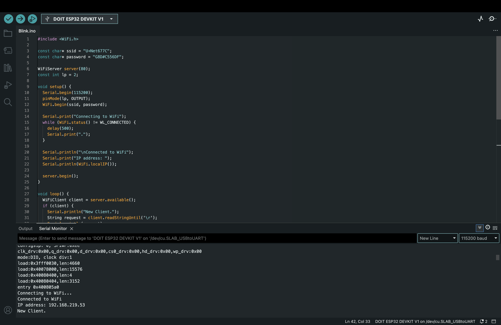

# IoT25-HW06

## Objective  
This assignment demonstrates how to build a simple web server using the ESP32, allowing users to control an onboard LED via a web interface.  
By connecting to a Wi-Fi network, the ESP32 hosts an HTML page with buttons to turn the LED on and off remotely.

---

## Arduino IDE Setting  
- **Board**: DOIT ESP32 DEVKIT V1  
- **Port**: /dev/cu.SLAB_USBtoUART



---

## Demonstration Video  
[🔗 Watch the ESP32 Web Server Demo](https://youtube.com/shorts/E3MSM-qFras?si=itS5zkXzdH7epf4d)

---

## Code

```cpp
#include <WiFi.h>

const char* ssid = "U+Net677C";
const char* password = "G8D#C556DF";

WiFiServer server(80);
const int ledPin = 2;

void setup() {
  Serial.begin(115200);
  pinMode(ledPin, OUTPUT);
  WiFi.begin(ssid, password);

  Serial.print("Connecting to WiFi");
  while (WiFi.status() != WL_CONNECTED) {
    delay(500);
    Serial.print(".");
  }

  Serial.println("\nConnected to WiFi");
  Serial.print("IP address: ");
  Serial.println(WiFi.localIP());

  server.begin();
}

void loop() {
  WiFiClient client = server.available();
  if (client) {
    Serial.println("New Client.");
    String request = client.readStringUntil('\r');
    Serial.println(request);
    client.flush();

    if (request.indexOf("/LED=ON") >= 0) {
      digitalWrite(ledPin, HIGH);
      Serial.println("LED ON");
    } 
    else if (request.indexOf("/LED=OFF") >= 0) {
      digitalWrite(ledPin, LOW);
      Serial.println("LED OFF");
    }

    client.println("HTTP/1.1 200 OK");
    client.println("Content-type:text/html");
    client.println();
    client.println("<!DOCTYPE html><html>");
    client.println("<head><meta charset='UTF-8'><title>ESP32 LED Control</title></head>");
    client.println("<body><h1>ESP32 LED Control</h1>");
    client.println("<p><a href=\"/LED=ON\"><button>Turn ON</button></a></p>");
    client.println("<p><a href=\"/LED=OFF\"><button>Turn OFF</button></a></p>");
    client.println("</body></html>");
    client.println();

    Serial.println("Client disconnected.");
    delay(1);
  }
}
